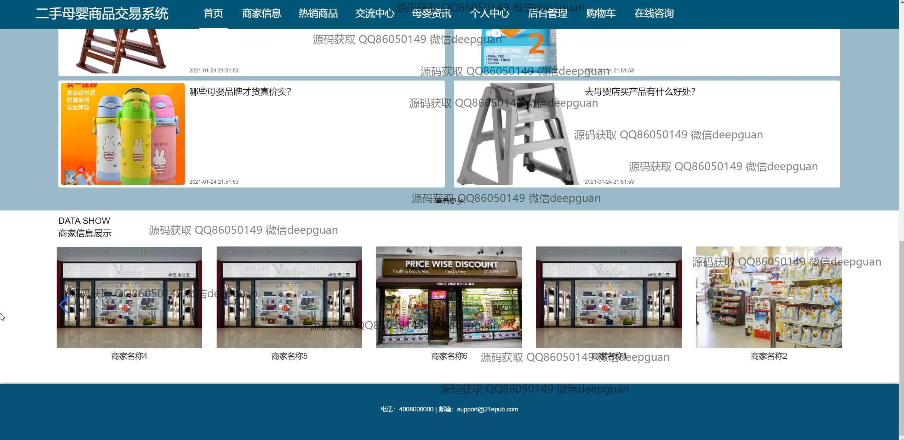
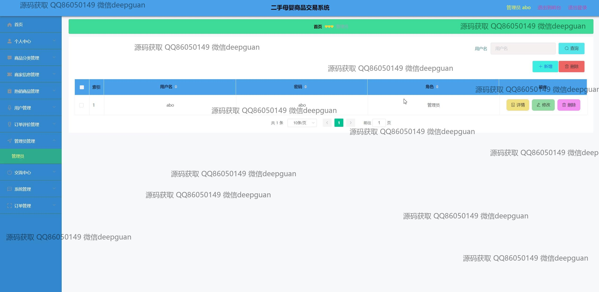

<h1 align="center">的二手母婴商品交易系统vue</h1>

## 简介
二手母婴商品交易系统：支持用户注册、商品管理、订单评价、在线咨询、收藏管理、评论互动、后台分类管理及订单追踪等多功能模块。    --计算机毕业设计源码；毕设源码；java毕业设计源码

## 联系方式

<h3 align="center">获取完整代码与数据库文件 + 微信：deepguan QQ: 86050149 QQ群: 783742310</h3>

<h3 align="center">可帮忙远程部署 包运行成功！提供远程部署、修改代码、设计文档指导、代码讲解等服务！</h3>

## 功能介绍（完整见运行截图）
管理员：基本功能包括登录、注册和退出。首页提供主导航栏，包含商品分类管理、商家信息管理、用户管理、订单管理、系统管理等模块。商品管理功能支持商品列表展示、商品搜索、商品详情查看、商品添加与编辑等操作。订单评价管理模块允许回复用户评论。用户管理涵盖用户信息查看、编辑与删除功能。支持后台管理操作，如帖子管理和母婴资讯管理，模块化设计便于系统化管理。

用户：用户可以通过注册和登录访问系统。首页包含导航栏，提供浏览商家信息、热门商品、交流中心、母婴资讯、个人中心、购物车和在线咨询等功能。商品部分支持查看商品详细信息、分类搜索、添加购物车和结算。个人中心提供查看和修改个人信息、管理收货地址、查询订单和处理我的收藏的功能。交易确认页显示购物清单和交易状态，便于购物操作。

## 运行截图

本代码来源于网络,仅供学习参考使用!

